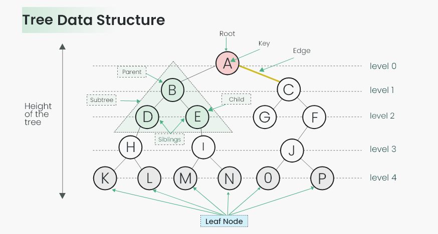
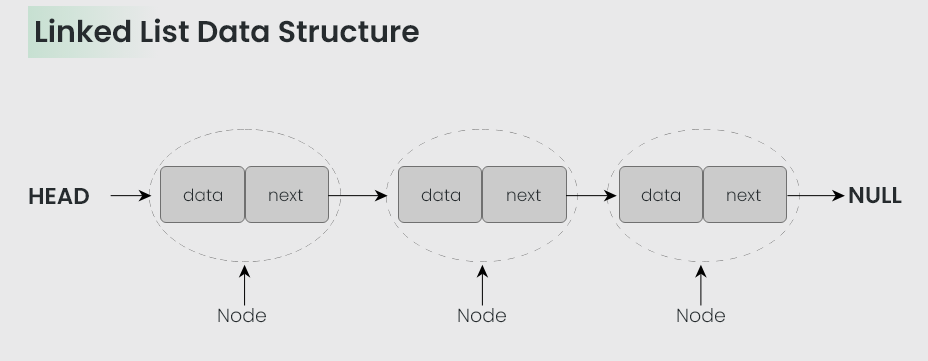

  
  
  

## Sorting Algorithms Complexity

The following table summarizes the time and space complexities of various sorting algorithms that have been implemented in this repository:

| Algorithm        | Best Time Complexity | Average Time Complexity | Worst Time Complexity | Space Complexity | Stable |
|------------------|----------------------|-------------------------|-----------------------|------------------|--------|
| Bubble Sort      | O(n)                 | O(n^2)                  | O(n^2)                | O(1)             | Yes    |
| Heap Sort        | O(n log n)           | O(n log n)              | O(n log n)            | O(1)             | No     |
| Insertion Sort   | O(n)                 | O(n^2)                  | O(n^2)                | O(1)             | Yes    |
| Quick Sort       | O(n log n)           | O(n log n)              | O(n^2)                | O(log n)         | No     |
| Selection Sort   | O(n^2)               | O(n^2)                  | O(n^2)                | O(1)             | No     |
| Merge Sort       | O(n log n)           | O(n log n)              | O(n log n)            | O(n)             | Yes    |
| Binary Tree Sort | O(n log n)           | O(n log n)              | O(n^2)                | O(n)             | Yes    |

*Note: "Stable" indicates whether the sorting algorithm maintains the relative order of equal elements. The worst-case time complexity of Binary Tree Sort depends on the structure of the binary tree formed, which is O(n^2) when the tree becomes a linear chain (degenerate tree).* 